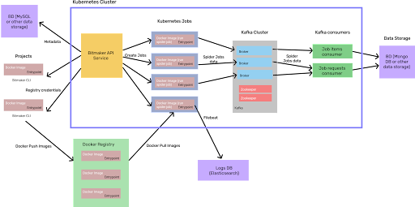

# Bitmaker Cloud Documentation

## Overview
[Bitmaker Cloud](https://github.com/bitmakerla/bitmaker-cloud) is an open-source
application created by [Bitmaker](https://www.bitmaker.la/) so that clients or users
interested in web scraping can orchestrate and run their spiders (e.g., Scrapy spiders),
similar to what [Zyte](https://www.zyte.com/) does, but with more versatility, to the
point that it can be deployed in-home.

The [Bitmaker CLI](https://github.com/bitmakerla/bitmaker-cli/) is in charge of Scrapy
based projects deployment, and uses an HTTP API client to upload projects, which are
then built into docker images and added to a Docker Registry.

Spider jobs are run by the Bitmaker API endpoint, which creates a [Kubernetes](https://kubernetes.io/) job
to complete every spider job (could also be a spider cronjob). Jobs send spider jobs
data to [Kafka](https://kafka.apache.org/) brokers through extensions and middlewares implemented in the entrypoint.
There are Kafka consumers that read the information and send data to a data storage (e.g., [MongoDB](https://www.mongodb.com/)).

## Architecture

## Structure
- [Bitmaker Cloud](https://github.com/bitmakerla/bitmaker-cloud/): It is composed of modules that work independently of the rest, and
  can be changed. E.g., use RabbitMQ instead of Kafka.
  - [Bitmaker API](https://github.com/bitmakerla/bitmaker-cloud/tree/main/bitmaker-api): Contains everything related to the API of the product, from where
    the spiders are managed.
  - [Bitmaker Kafka](https://github.com/bitmakerla/bitmaker-cloud/tree/main/bitmaker-kafka): Contains everything related to the Kafka cluster used to collect
    and transport the information of the spiders.
  - [Bitmaker Web](https://github.com/bitmakerla/bitmaker-cloud/tree/main/bitmaker-web): Contains everything related to the front end of the product, from
    where you can manage the spiders with a user-friendly interface.
- [Bitmaker Cloud CLI](https://github.com/bitmakerla/bitmaker-cli/): This is the command line client to interact with Bitmaker Cloud API.
- [Bitmaker Entrypoint](https://github.com/bitmakerla/bitmaker-entrypoint): This is package that implements a wrapper layer to extract job
  data from environment, prepare the job properly, and execute it using Scrapy.

## Get Started
From here, we recommend reading through the following docs:

- [Install the Bitmaker CLI]
- [Configure your Deployment]
